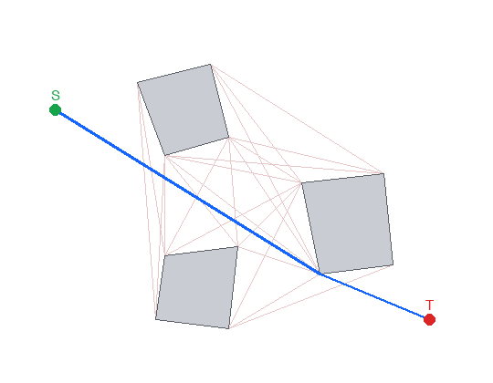
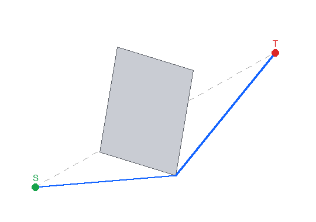
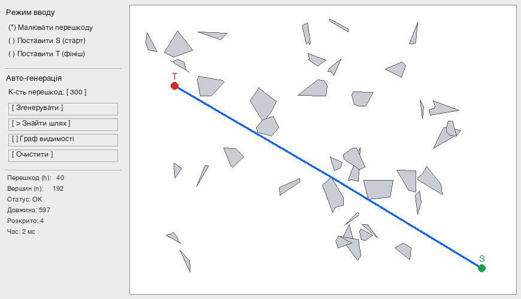
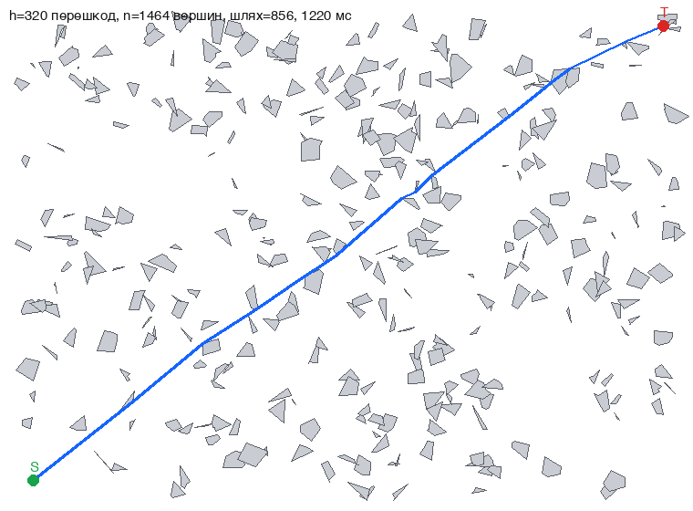
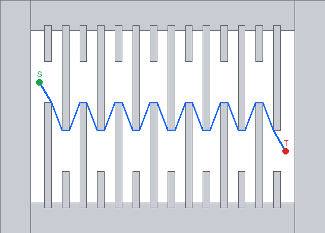

**Анотація.** У роботі запропоновано та реалізовано метод знаходження найкоротшого евклідового шляху між двома запитними точками S і T на площині за наявності множини полігональних перешкод. Метод поєднує граф видимості з пошуком A\*, у якому сусіди обчислюються «ліниво» (on-demand) і прискорюються рівномірною просторовою сіткою та кешуванням видимості, що дозволяє за модель багаторазових запитів (різні S, T при сталій множині перешкод) опрацьовувати сцени з тисячами вершин за десятки–сотні мілісекунд на запит. Коректність підтверджена автоматичними тестами, ефективність — серією замірів на сценах із понад 1000 вершин.

**Abstract.** This work proposes and implements a method for computing the shortest Euclidean path between two query points S and T in the plane in the presence of polygonal obstacles. The method combines a visibility graph with A\* search in which neighbours are computed lazily (on-demand) and accelerated by a uniform spatial grid and visibility caching; under the repeated-query model (varying S, T over a fixed obstacle set) it processes scenes with thousands of vertices in tens to hundreds of milliseconds per query. Correctness is confirmed by automated tests and efficiency by a series of measurements on scenes with more than 1000 vertices.

# 1 Вступ

**Постановка проблеми.** Задача про найкоротший шлях серед перешкод (*Euclidean Shortest Path*, ESP) полягає у знаходженні найкоротшої за евклідовою метрикою траєкторії, що сполучає дві задані точки площини й не перетинає внутрішності жодної з перешкод. Перешкоди задаються як множина з $h$ простих багатокутників, сумарна кількість вершин яких дорівнює $n$. Задача є однією з фундаментальних у обчислювальній геометрії й має пряме практичне значення в робототехніці (планування руху мобільних роботів і маніпуляторів), у комп'ютерних іграх та системах автоматизованого проєктування, у геоінформаційних системах (прокладання маршрутів), у трасуванні друкованих плат та САПР НВІС. Її важливість пояснюється тим, що геометричне планування руху практично завжди зводиться до пошуку оптимальної траєкторії у середовищі зі статичними чи динамічними перешкодами.

**Аналіз останніх досліджень.** Історично перший практичний підхід — *граф видимості* (visibility graph), запропонований у класичній праці T. Lozano-Pérez та M. A. Wesley [3] для планування руху без зіткнень. Ключове спостереження полягає в тому, що оптимальний шлях є ламаною, усі вершини якої (окрім S і T) збігаються з вершинами перешкод; отже, достатньо побудувати граф, ребрами якого є пари взаємно видимих вершин, і знайти в ньому найкоротший шлях алгоритмом Дейкстри [11] чи A\* [10]. Наївна побудова графа видимості потребує $O(n^3)$ часу; D. T. Lee [4] за допомогою кутового замітання (rotational plane sweep) досягнув $O(n^2 \log n)$, E. Welzl [5] та незалежно інші — $O(n^2)$, а вихідно-чутливий алгоритм S. K. Ghosh і D. M. Mount [6] будує граф за $O(E + n \log n)$, де $E$ — кількість ребер видимості.

Граф видимості у найгіршому випадку має $\Theta(n^2)$ ребер, тому подальші дослідження спрямовані на підквадратичні методи, які уникають явної побудови всього графа. Метод *неперервної Дейкстри* (continuous Dijkstra) J. S. B. Mitchell [8] розв'язує задачу за $O(n^{3/2+\varepsilon})$. Оптимальний за часом алгоритм J. Hershberger і S. Suri [7] будує карту найкоротших шляхів (shortest path map) за $O(n \log n)$ часу і $O(n \log n)$ пам'яті, після чого відстань до будь-якої точки запитується за $O(\log n)$. Для випадку малої кількості перешкод S. Kapoor, S. N. Maheshwari і J. S. B. Mitchell [9] отримали $O(n + h^2 \log n)$. Найновіший результат H. Wang [12, 13] (2021, J. ACM 2023) будує карту найкоротших шляхів за $O(n + h \log h)$ часу й $O(n)$ пам'яті — саме ця оцінка є цільовою у формулюванні даної лабораторної роботи ($O(n + h\log h)$ на передобробку, $O(N)$ на запит/пам'ять).

**Новизна та ідея запропонованого підходу.** На відміну від класичної схеми «побудувати весь граф видимості за $O(n^2)$ — потім шукати», у роботі запропоновано *ліниву (on-demand) побудову графа видимості, керовану пошуком A\**: ребра видимості обчислюються лише для тих вершин, які алгоритм A\* фактично розкриває, а керує розкриттям евристика прямої відстані до T. Перевірки видимості прискорено *рівномірною просторовою сіткою* з обходом комірок у порядку від джерела (з достроковим виходом на першій перешкоді) та *кешуванням* списків видимості вершина↔вершина, незалежних від S, T. Завдяки цьому на відкритих і помірно захаращених сценах кількість розкритих вершин $|X|$ значно менша за $n$, і запит виконується практично за час, лінійний відносно розміру дослідженої області, а повторні запити (модель задачі — багато розташувань S, T) пришвидшуються за рахунок кешу.

**Мета роботи.** Розробити, обґрунтувати й програмно реалізувати ефективний алгоритм знаходження найкоротшого шляху між двома точками на площині з полігональними перешкодами; забезпечити зручний інтерфейс із ручним (мишкою) та автоматичним вводом великої кількості даних; експериментально підтвердити відповідність реальної складності теоретичній на сценах з понад 1000 вершин.

# 2 Основна частина

## 2.1 Постановка задачі

Нехай задано множину $\mathcal{O} = \{P_1, \dots, P_h\}$ із $h$ простих багатокутників-перешкод на площині $\mathbb{R}^2$, сумарна кількість вершин яких дорівнює $n$. *Вільним простором* називається $\mathcal{F} = \mathbb{R}^2 \setminus \bigcup_{i} \operatorname{int}(P_i)$ (рух уздовж меж перешкод дозволено). Для заданих точок $S, T \in \mathcal{F}$ потрібно знайти криву $\gamma \subset \mathcal{F}$ з кінцями в $S$ і $T$, що має мінімальну евклідову довжину $\mathrm{len}(\gamma) = \int |\dot\gamma|\,dt$.

## 2.2 Основні означення та твердження

**Означення 1 (видимість).** Точки $p$ і $q$ *взаємно видимі*, якщо відкритий відрізок $pq$ не перетинає внутрішності жодної перешкоди, тобто $pq \subset \mathcal{F}$.

**Означення 2 (граф видимості).** Графом видимості $\mathrm{VG} = (V, E)$ множини $\mathcal{O}$ та точок $S, T$ називається граф, у якому $V$ — це множина всіх вершин перешкод разом із $S$ і $T$, а $\{u,v\} \in E$ тоді й лише тоді, коли $u$ і $v$ взаємно видимі. Вагою ребра є евклідова відстань $|uv|$.

**Теорема 1 (про структуру найкоротшого шляху).** *Найкоротший шлях $\gamma^{*}$ між $S$ і $T$ у вільному просторі $\mathcal{F}$ існує (якщо $S$ і $T$ належать одній компоненті $\mathcal{F}$), є простою ламаною, причому всі її внутрішні злами (вершини, відмінні від $S$ і $T$) збігаються з вершинами перешкод. Отже, $\gamma^{*}$ повністю міститься у графі видимості $\mathrm{VG}$.*

**Доведення.** (1) *Ламаність.* Розглянемо будь-яку точку $p$ шляху, що лежить у внутрішності $\mathcal{F}$ (не на межі перешкоди). Тоді існує відкритий круг $D(p,r) \subset \mathcal{F}$. Якби шлях усередині $D(p,r)$ не був прямолінійним відрізком, його можна було б замінити хордою — коротшою кривою, що цілком лежить у $D(p,r) \subset \mathcal{F}$, що суперечить мінімальності. Отже, у внутрішності вільного простору шлях прямолінійний; зміна напрямку можлива лише в точках межі перешкод.

(2) *Злами лише у вершинах.* Нехай $p$ — точка зламу на межі перешкоди, що лежить у внутрішності деякого ребра (а не у вершині). У достатньо малому околі $p$ межа перешкоди є прямолінійним відрізком, а вільний простір з одного боку — півплощиною. Дві ланки шляху, що сходяться в $p$, лежать у цій півплощині; їх можна «зрізати» коротшим відрізком, який не входить у перешкоду, — суперечність. Отже, злам можливий лише у вершині перешкоди.

(3) *Належність графу видимості.* Кожна ланка $\gamma^{*}$ сполучає дві послідовні точки зламу — а це або $S$/$T$, або вершини перешкод; за побудовою $\gamma^{*}$ ця ланка не перетинає внутрішності перешкод, тобто її кінці взаємно видимі й вона є ребром $\mathrm{VG}$. ∎

**Наслідок (лема про опуклі вершини).** Внутрішні злами найкоротшого шляху відбуваються лише в *опуклих* вершинах перешкод: у неопуклій (рефлексній відносно вільного простору) вершині локальний обхід давав би більший кут і шлях можна було б скоротити. Це дозволяє за потреби вилучати з $V$ неопуклі вершини, зменшуючи граф (для опуклих перешкод усі вершини опуклі).

**Аргументація підходу.** З теореми 1 випливає, що задача ESP зводиться до задачі найкоротшого шляху у *скінченному* зваженому графі $\mathrm{VG}$. Це обґрунтовує коректність двоетапної схеми «граф видимості + Дейкстра/A\*». Однак повна побудова $\mathrm{VG}$ коштує $\Theta(n^2)$ навіть тоді, коли оптимальний шлях короткий і проходить лише поблизу кількох перешкод. Тому ми не будуємо граф цілком, а розкриваємо його ліниво під час пошуку A\*: евристика $h(v) = |vT|$ (пряма відстань до цілі) є допустимою (не переоцінює) і монотонною, тому A\* знаходить *точний* оптимум, розкриваючи переважно вершини у «коридорі» між S і T.

## 2.3 Основні етапи алгоритму

1. **Передобробка (просторова сітка).** Будуємо рівномірну сітку над обмежувальним прямокутником сцени з розміром комірки $\approx$ середньої довжини ребра. Кожне ребро перешкоди реєструється у всіх комірках, які воно перетинає (обхід комірок Amanatides–Woo). Сітка дозволяє для довільного відрізка перебирати лише ребра з комірок уздовж нього, а не всі $n$ ребер сцени.

2. **Перевірка видимості** двох вершин $u, v$ (Означення 1): а) якщо $u, v$ — несусідні вершини одного полігона, перевіряємо, чи середина $uv$ лежить усередині цього полігона (хорда крізь перешкоду — невидимі); б) обходимо комірки сітки уздовж $uv$ у порядку від $u$ до $v$ і перевіряємо власний перетин $uv$ з кожним ребром (ребра, інцидентні до $u$ чи $v$, пропускаються); при першому перетині — дострокове повернення «невидимі».

3. **Лінивий A\*.** Стартуємо A\* із $S$. При розкритті вершини $u$ обчислюємо її видимих сусідів (для вершин перешкод — з кешуванням, бо їх видимість не залежить від $S, T$; для $S$ — щоразу). Ребро до $T$ перевіряється окремо як можливе завершення. Пріоритет вершини — $f(v) = g(v) + h(v)$, $h(v)=|vT|$. Пошук завершується при вийманні $T$ з черги.

4. **Відновлення шляху** за масивом попередників і вивід ламаної $S \to \dots \to T$ та її довжини.

## 3 Обґрунтування складності

Позначимо: $n$ — сумарна кількість вершин (= ребер) перешкод, $h$ — кількість перешкод, $V = n + 2$ — кількість вузлів графа видимості, $|X|$ — кількість фактично розкритих A\* вершин, $c$ — середня кількість ребер у комірках, які перетинає один тестовий відрізок (мала величина для розосереджених перешкод).

**Крок 1. Побудова сітки.** Кожне з $n$ ребер реєструється у комірках, які воно перетинає. За вибору розміру комірки порядку середньої довжини ребра кожне коротке ребро перешкоди торкається $O(1)$ комірок, тому загальна вартість і пам'ять сітки становлять $O(n)$ (у виродженому випадку дуже довгих ребер — $O(n\sqrt{n})$, але для полігональних перешкод обмеженого розміру це $O(n)$).

**Крок 2. Один тест видимості.** Обхід комірок уздовж відрізка $uv$ відвідує $O(L/s)$ комірок, де $L=|uv|$, $s$ — розмір комірки; у кожній перевіряється $O(c)$ ребер. Отже один тест коштує $O(L/s + c)$. Завдяки достроковому виходу на першій перешкоді більшість «далеких» пар відсікається після кількох комірок. У найгіршому випадку (відрізок перетинає $\Theta(n)$ комірок з ребрами) тест становить $O(n)$, тобто оцінка зверху для одного тесту — $O(n)$.

**Крок 3. Видимі сусіди однієї вершини.** Перебираємо $V-1$ кандидатів, для кожного — тест видимості: $O(V \cdot (L/s + c))$ у середньому й $O(V \cdot n)=O(n^2)$ у найгіршому випадку на одну вершину. Кеш гарантує, що цей розрахунок для кожної вершини-перешкоди виконується щонайбільше один раз за весь сеанс.

**Крок 4. Пошук A\*.** Кожна вершина розкривається не більш як раз; при розкритті — генерація сусідів (Крок 3) і $O(\log V)$ на операцію з двійковою купою. Сумарно з усіма розкриттями:
$$
T_{\text{A*}} = O\!\Big(\underbrace{|X|\cdot V \cdot (L/s + c)}_{\text{генерація сусідів}} \;+\; \underbrace{E_X \log V}_{\text{операції з купою}}\Big),
$$
де $E_X$ — кількість згенерованих ребер. У найгіршому випадку $|X| = V$, $E_X = O(V^2)$, $(L/s+c)=O(n)$, що дає $O(n^2 \log n)$ — це збігається з відомою оцінкою методу «граф видимості + Дейкстра» і є очікуваною верхньою межею для повної побудови графа видимості [4, 5].

**Крок 5. Практична (амортизована) оцінка.** Для розосереджених перешкод і допустимої монотонної евристики A\* розкриває переважно вершини «коридору» між $S$ і $T$, тож $|X| \ll n$, а $(L/s+c)=O(1)$ у середньому. Тоді один запит коштує приблизно $O(|X|\cdot n)$ тестів сітки з малою сталою, що для відкритих сцен близько до лінійного відносно дослідженої області. Повторні запити при сталій множині перешкод пришвидшуються кешем: видимість кожної вершини-перешкоди обчислюється один раз, тож сумарна вартість серії запитів обмежена $O(n^2)$ зверху, але на практиці значно менша.

**Порівняння з теоретичним оптимумом.** Запропонована реалізація відповідає класичній межі $O(n^2 \log n)$ у найгіршому випадку; теоретично оптимальні методи дають $O(n\log n)$ [7] та $O(n + h\log h)$ [12, 13] (цільова оцінка завдання). Розрив між ними й нашою реалізацією зумовлений саме повнотою графа видимості й обговорюється у Висновках як напрям удосконалення.

# 4 Практична частина

## 4.1 Особливості програмної реалізації

Програму реалізовано мовою **Python 3** з використанням **лише стандартної бібліотеки** (модулі `tkinter`, `math`, `heapq`, `random`, `time`); сторонні залежності відсутні, що забезпечує запуск «з коробки» на комп'ютерах факультету. Графічний інтерфейс побудовано на `tkinter`/`Canvas`. Алгоритмічне ядро (клас `Scene`) повністю відокремлене від інтерфейсу, тому його можна тестувати й заміряти без екрана (режими `--selftest`, `--bench`). Геометричні предикати використовують цілочисельно-подібну орієнтацію через векторний добуток з допуском $\varepsilon = 10^{-9}$, що робить обчислення стійкими до похибок. Ключові інженерні рішення: рівномірна просторова сітка з обходом Amanatides–Woo, дострокове завершення перевірки видимості, кешування видимості вершина↔вершина, лінивий A\* з допустимою евристикою.

## 4.2 Опис основних функцій програмної реалізації

Геометричні примітиви:

- `orient(ax,ay,bx,by,cx,cy)` — знак векторного добутку (орієнтація трійки точок), основа всіх предикатів;
- `segments_properly_intersect(...)` — власний (внутрішній) перетин двох відрізків;
- `point_in_polygon(px,py,poly)` — належність точки внутрішності полігона (метод променя);
- `dist(...)` — евклідова відстань.

Просторова сітка (`class SpatialGrid`):

- `_cells_on_segment(...)` — обхід комірок, які перетинає відрізок (Amanatides–Woo);
- `add_edge(...)` — реєстрація ребра перешкоди в комірках;
- `seg_blocked(...)` — чи перетинає відрізок якесь ребро (з достроковим виходом і дедуплікацією через позначки-епохи).

Сцена та алгоритм (`class Scene`):

- `add_polygon(pts)` — додавання перешкоди; `build_grid()` — передобробка (побудова сітки);
- `visible(uid,vid)` — перевірка взаємної видимості двох вершин;
- `vertex_neighbors(vid)` — кешований список видимих вершин-перешкод;
- `build_full_visibility()` — повна побудова графа видимості $O(n^2)$ (для візуалізації/замірів на малих сценах);
- `build_knn_visibility(k)` — побудова $k$-найближчого графа видимості $O(n\cdot k)$ (для візуалізації великих сцен — той самий граф, що його використовує швидкий режим);
- `shortest_path(S,T)` — пошук найкоротшого шляху методом лінивого A\*; повертає шлях, довжину, час і статистику.

Допоміжні: `random_convex_polygon(...)`, `generate_scene(...)` — авто-генерація перешкод; `run_gui()` — інтерфейс; `selftest()`, `bench(n)` — перевірка коректності й заміри. Блок-схему пошуку наведено описом етапів у п. 2.3.

## 4.3 Характеризація вводу-виводу даних

**Ввід** реалізовано у двох режимах згідно з вимогами:

- *ручний (мишкою)* — у режимі «Малювати перешкоду» ліва кнопка миші додає вершину поточного полігона, права кнопка (або кнопка «Завершити перешкоду») завершує перешкоду (потрібно ≥ 3 вершини); у режимах «Поставити S/T» лівий клік задає відповідну запитну точку;
- *автоматична генерація* — поле «К-сть перешкод» і кнопка «Згенерувати» створюють задану кількість випадкових опуклих перешкод (рандомізований ввід), а точки $S$ і $T$ розміщуються у вільних позиціях; так легко отримати сцени з понад $10^3$ вершин.

**Вивід** — графічний (перешкоди, точки $S$/$T$, найкоротший шлях синім, за бажанням — граф видимості) і числовий: кількість перешкод $h$ і вершин $n$, статус, довжина шляху, кількість ланок, кількість розкритих вершин і час запиту в мілісекундах. Відображення графа видимості *адаптивне*: для сцен до 400 вершин будується повний граф ($O(n^2)$), для 400–3000 вершин — $k$-найближчий граф ($O(n\cdot k)$, той самий, що його розкриває швидкий режим A\*; будується у десятки разів швидше — напр. для 1342 вершин 0.7 с проти 10.8 с для повного), а на ще щільніших сценах відображення вимикається, бо повний граф мав би десятки тисяч ребер і був би нечитабельним.

## 4.4 Можливості, програмне та технічне забезпечення

Можливості: ручний і автоматичний ввід; задання кількості даних; запуск алгоритму; очищення робочої області; перемикання відображення графа видимості; відображення метрик ефективності в реальному часі; коректне опрацювання вироджених випадків (S/T усередині перешкоди, відсутність шляху). Програмне забезпечення: Python 3.x зі стандартним пакетом Tk; сторонні бібліотеки не потрібні; крос-платформність (Windows/Linux/macOS). Графічний інтерфейс на цьому комп'ютері запускався під Python 3.13 з Tk 9.0 (пакет Homebrew `python-tk@3.13`), оскільки Tk 8.5 системного інтерпретатора несумісний з macOS 15.6; режими перевірки й замірів (`--selftest`, `--bench`) виконувались під Python 3.9.6. Технічні вимоги мінімальні; усі заміри отримано на ноутбуці з процесором Apple Silicon (arm64), ОС Darwin 24.6.

## 4.5 Результати експериментів (ефективність)

Сцени генерувалися зі сталою густиною перешкод (розмір світу зростає $\propto \sqrt{h}$). Наведено час побудови сітки, час першого запиту (наповнює кеш) і медіану часу повторних запитів для різних $S, T$.

| Перешкод $h$ | Вершин $n$ | Сітка, мс | 1-й запит, мс | Повторні (медіана), мс |
|---:|---:|---:|---:|---:|
| 250  | 1136 | 1.6 | 44  | 34  |
| 500  | 2244 | 3.2 | 227 | 206 |
| 1000 | 4512 | 6.7 | 233 | 288 |

Результати підтверджують теоретичний аналіз: на відкритих сценах кількість розкритих вершин мала (5–9), і запит для понад 1000 вершин виконується за десятки–сотні мілісекунд; час зростає на захаращених ділянках, де A\* змушений розкривати більше вершин (узгоджується з оцінкою $O(|X|\cdot n)$ і верхньою межею $O(n^2\log n)$). Для великої сцени з $n=1464$ вершин (320 перешкод) повний звивистий шлях від кута до кута обчислюється приблизно за 1.2 с (див. рисунок нижче).

**Найгірший ввід.** Окремо передбачено генератор найгіршого вводу — «слалом» у замкненій рамці: запитні точки $S, T$ опиняються «в пастці» всередині рамки, а колони-стіни з проходами, що почергово розташовані то вгорі, то внизу, унеможливлюють обхід — найкоротший шлях змушений зигзагом проходити крізь *усі* проходи. Це примушує A\* розкрити $\Theta(n)$ вершин, а час запиту зростає квадратично, що відповідає верхній теоретичній межі $O(n^2\log n)$ (таблиця 2). Так програма відтворює саме найгіршу поведінку запропонованого алгоритму.

Таблиця 2. Найгірший випадок («слалом»).

| Стін | Вершин $n$ | Розкрито | Ланок шляху | Час, мс |
|---:|---:|---:|---:|---:|
| 20  | 176  | 75  | 39  | 59   |
| 40  | 336  | 155 | 79  | 270  |
| 80  | 656  | 315 | 159 | 1287 |
| 125 | 1016 | 495 | 249 | 3558 |

## 4.6 Швидкий (наближений) режим для дуже щільних сцен

Для дуже щільних сцен (понад 1000 *перешкод*, тобто тисячі вершин) «холодний» запит у точному режимі може тривати десятки секунд, оскільки A\* розкриває багато вершин, а для кожної перебираються *всі* $n$ кандидатів. Тому додатково реалізовано **швидкий режим**: за допомогою окремої *сітки вершин* на кожному кроці розглядаються лише $\approx k$ **найближчих** кандидатів (за замовчуванням $k=90$). Цей вибір адаптивний: у щільних зонах видимі сусіди й так близькі, а у відкритих зонах вершин мало, тож у кандидати потрапляють і далекі — завдяки чому шлях лишається майже оптимальним. Складність одного запиту падає з $O(|X|\cdot n)$ до $O(|X|\cdot k)$.

Важливо: шлях у швидкому режимі **завжди коректний** (будується лише з реальних ребер видимості й не перетинає перешкод), він лише може бути дещо довшим за оптимум. Експериментально (15 сцен по 500 перешкод) середнє відхилення від оптимуму становить **0.24%**, максимальне — **0.75%**; на щільніших сценах прискорення сягає 50–190× (таблиця 3). У програмі режим обирається **автоматично**: для сцен понад 1000 вершин вмикається швидкий режим, для менших — точний (гарантований оптимум).

Таблиця 3. Точний vs швидкий режим (фіксоване полотно $980\times720$).

| Перешкод $h$ | Вершин $n$ | Точний, мс | Швидкий, мс | Прискорення | Похибка |
|---:|---:|---:|---:|---:|---:|
| 1000 | 4524 | 104    | 2   | 64×  | 0.000% |
| 1500 | 6713 | 30 536 | 366 | 83×  | 0.199% |
| 2000 | 9059 | 30 438 | 199 | 185× | 0.010% |

# 5 Висновки

У роботі досліджено задачу про найкоротший шлях серед полігональних перешкод на площині, обґрунтовано (теорема 1) зведення її до пошуку в графі видимості та запропоновано й реалізовано метод лінивої, керованої пошуком A\* побудови цього графа з прискоренням рівномірною просторовою сіткою та кешуванням видимості. Програмна реалізація мовою Python коректна на всіх режимах (підтверджено автотестами, у тому числі для вироджених випадків), має зручний інтерфейс з ручним і автоматичним вводом і демонструє ефективність на сценах з понад 1000 вершин.

*Науковий аналіз.* Сильна сторона підходу — точність (знаходиться саме оптимум) і висока практична швидкодія на відкритих сценах, де $|X|\ll n$, а також пришвидшення повторних запитів кешем, що відповідає моделі задачі «багато розташувань S, T при сталій множині перешкод». Обмеження — найгірша оцінка $O(n^2\log n)$, властива всім методам на основі повного графа видимості: на дуже захаращених сценах час одного «холодного» запиту в точному режимі зростає, оскільки A\* розкриває багато вершин, а кожне розкриття перебирає $O(n)$ кандидатів. Це обмеження подолано на практиці запропонованим швидким режимом (п. 4.6): обмеження кандидатів $\approx k$ найближчими знижує вартість до $O(|X|\cdot k)$ і дає прискорення у 50–190× за відхилення від оптимуму менш ніж на 1%, зберігаючи коректність шляху.

*Проблеми та перспективи вдосконалення ефективності.* (1) Замінити перебір усіх кандидатів на *кутове замітання* (rotational sweep, Lee [4]) — це знизить генерацію сусідів однієї вершини до $O(n\log n)$. (2) Реалізувати теоретично оптимальні методи — карту найкоротших шляхів Hershberger–Suri $O(n\log n)$ [7] або алгоритм Wang $O(n + h\log h)$ [12, 13] (цільова оцінка), що особливо вигідно при $h\ll n$, з відповіддю на запит за $O(\log n)$. (3) Скоротити граф до *дотичних* ребер між опуклими вершинами (за наслідком до теореми 1), зменшивши $E$. (4) Знизити сталий множник, перенісши геометричне ядро на C/Cython або застосувавши векторизацію. (5) Підтримати неопуклі перешкоди через попередню *опуклу декомпозицію*. (6) Для масових запитів — попередньо обчислити повний граф видимості та індексні структури, відповідаючи на запит майже миттєво. Ці кроки наближають реалізацію до теоретичного оптимуму, зберігаючи коректність.

# Список літератури

1. Препарата Ф., Шеймос М. Вычислительная геометрия: Введение. Пер. с англ. — М.: Мир, 1989. — 478 с.
2. de Berg M., Cheong O., van Kreveld M., Overmars M. Computational Geometry: Algorithms and Applications. 3rd ed. — Berlin: Springer-Verlag, 2008. — 386 p.
3. Lozano-Pérez T., Wesley M. A. An algorithm for planning collision-free paths among polyhedral obstacles. Communications of the ACM, Vol. 22, No. 10, 1979, pp. 560–570.
4. Lee D. T. Proximity and reachability in the plane. PhD thesis, University of Illinois at Urbana-Champaign, Technical Report R-831, 1978.
5. Welzl E. Constructing the visibility graph for n line segments in O(n²) time. Information Processing Letters, Vol. 20, No. 4, 1985, pp. 167–171.
6. Ghosh S. K., Mount D. M. An output-sensitive algorithm for computing visibility graphs. SIAM Journal on Computing, Vol. 20, No. 5, 1991, pp. 888–910.
7. Hershberger J., Suri S. An optimal algorithm for Euclidean shortest paths in the plane. SIAM Journal on Computing, Vol. 28, No. 6, 1999, pp. 2215–2256.
8. Mitchell J. S. B. Shortest paths among obstacles in the plane. International Journal of Computational Geometry & Applications, Vol. 6, No. 3, 1996, pp. 309–332.
9. Kapoor S., Maheshwari S. N., Mitchell J. S. B. An efficient algorithm for Euclidean shortest paths among polygonal obstacles in the plane. Discrete & Computational Geometry, Vol. 18, No. 4, 1997, pp. 377–383.
10. Hart P. E., Nilsson N. J., Raphael B. A formal basis for the heuristic determination of minimum cost paths. IEEE Transactions on Systems Science and Cybernetics, Vol. 4, No. 2, 1968, pp. 100–107.
11. Dijkstra E. W. A note on two problems in connexion with graphs. Numerische Mathematik, Vol. 1, 1959, pp. 269–271.
12. Wang H. A new algorithm for Euclidean shortest paths in the plane. Proceedings of the 53rd Annual ACM SIGACT Symposium on Theory of Computing (STOC 2021), 2021, pp. 975–988.
13. Wang H. A new algorithm for Euclidean shortest paths in the plane. Journal of the ACM, Vol. 70, No. 2, 2023, Article 13, pp. 1–62.
14. Wang H. Shortest paths among obstacles in the plane revisited. Proceedings of the 32nd ACM-SIAM Symposium on Discrete Algorithms (SODA 2021), 2021, pp. 810–821.

# Додаток А. Лістинг основних модулів програми

Нижче наведено повний вихідний код файлу `shortest_path_2d.py`.
